## bamazon-customer
The App is a Node.js application designed to help users select product they want to buy.
The Following technologies were used to developed the Application
1. Mysql as database
2. Node.js
3. Dependencies include;
    1. npm modules
    2. npm inquirer module
    
    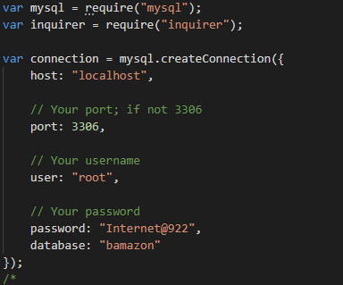
   
## Currently the Application has two modules as follows;
1. Customer Module
   1.This is designed to enable a customer buy things from tha App
   2. It can be acces from node.js using bamazoncustomers.js
2. Manager Module
   1. This module is accessed through bamazonManager.js file
   2. It is designed to enable Manager add inventory, pull reports , add new products to store etc

### Sample of Transaction Activities
# Customer Module
a. The Store prompts the user to select product based on what is available on DB

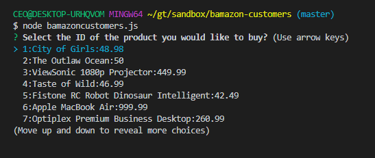

b. customers makes a select of product with ID of 3
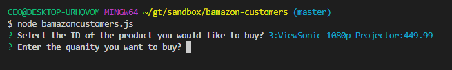

c. Purchased Confirmed and Db updated
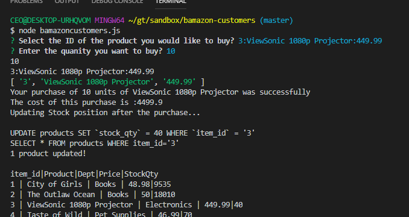

d. Cost of Purchase Computed and displayed
 
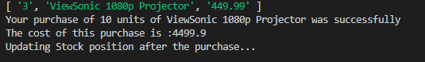

e. Customer selects more quantity is available in db
 
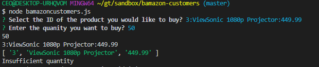

f. Updating Transactions in the Database
 
  i. image 1 Database Bafore the transaction
   
  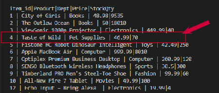
   
  ii. image 2 Database after the transaction
   
  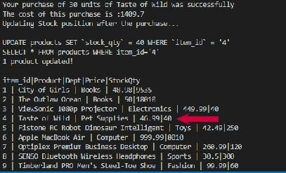
   
   
  ## Manager Module
   
  ### Manager Acivity Options
   
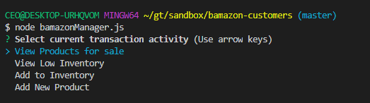
 
1. View Products on Sale
 
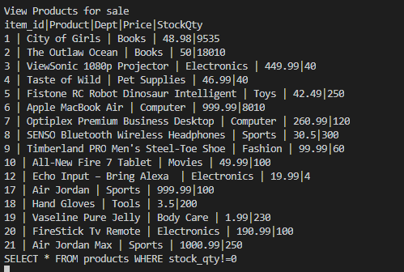
 
2. View Low Inventory
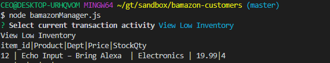
